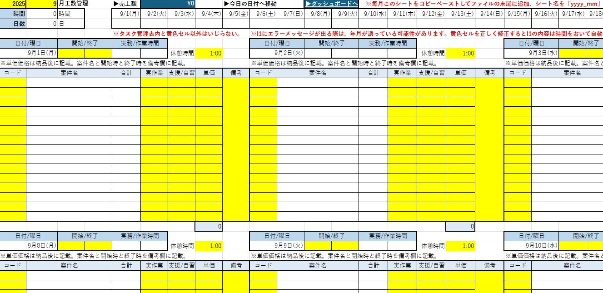

# 業務効率化システム

## 最新版ダウンロード
** [業務効率化システム_吉岡有隆_2025.xlsm をダウンロード](docs/業務効率化システム_吉岡有隆_2025.xlsm)**  

---

# 業務効率化システム

フリーランス・在宅ワーカー・福祉職・事務職向けの **Excel ダッシュボード & VBA 自動化ツール** です。
月別給料・案件別単価売上・勤怠管理・工数・体調記録・タスク管理・KPIなどを一元管理できます。

## スクリーンショット

### ダッシュボード画面

### 工数管理画面

## 主な特徴
- ダッシュボードから当月の売上・工数・リソース状況を一目で把握
- 「本日のシートへ移動」「手動入力内容クリア」など実用的なVBAマクロ
- `yyyy_mm` 形式の月次シート構造で長期運用を想定
- 体調・気圧データの入力欄と可視化グラフ

## 動作環境
- Microsoft Excel 2019 以降 (Windows/Mac)
- VBAマクロを有効化してご利用ください。

## ライセンス
このプロジェクトは [MIT License](LICENSE) の下で提供されています。
Copyright (c) 2025 Yoshioka Yutaka

## 作者
吉岡有隆 (Yoshioka Yutaka)
初版: 2025-09-14

# Business Efficiency System

## Latest Version Download
** [Download BusinessEfficiencySystem_YoshiokaYutaka_2025.xlsm](docs/業務効率化システム_吉岡有隆_2025.xlsm) **  

---

# Business Efficiency System

An **Excel Dashboard & VBA Automation Tool** designed for freelancers, remote workers, welfare professionals, and office staff.  
It allows integrated management of monthly salaries, project-based unit sales, attendance, workload, health records, task management, and KPIs.

## Key Features
- Instantly grasp current month’s sales, workload, and resource status from the dashboard  
- Practical VBA macros such as “Jump to Today’s Sheet” and “Clear Manual Inputs”  
- Monthly sheet structure in `yyyy_mm` format for long-term operation  
- Input fields and visualization graphs for health and barometric pressure data  

## System Requirements
- Microsoft Excel 2019 or later (Windows/Mac)  
- Enable VBA macros to use this system  

## License
This project is provided under the [MIT License](LICENSE).  
Copyright (c) 2025 Yoshioka Yutaka  

## Author
Yoshioka Yutaka  
First Edition: 2025-09-14

